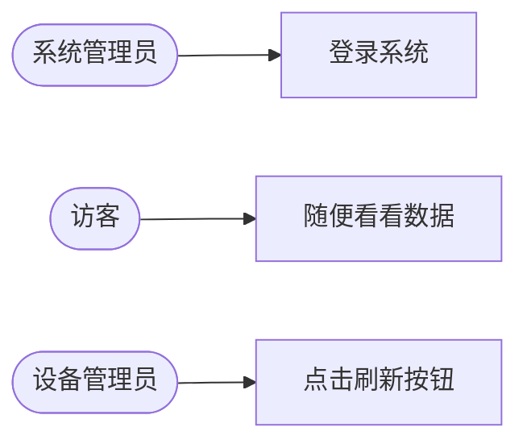

# AI 初稿 · 用例图（对照用）

## AI 组织说明（摘录）

拟用 flowchart 画参与者与用例；可能额外加入「系统管理员」「访客」；include 关系容易漏画。

## 问题草稿（勿直接采用）

```mermaid
flowchart LR
  SysAdmin([系统管理员])
  Guest([访客])
  Admin([设备管理员])
  SysAdmin --> Login[登录系统]
  Guest --> View[随便看看数据]
  Admin --> Click[点击刷新按钮]
```

问题：超范围参与者；用例写成界面操作步骤；缺少「采集 Modbus 数据」的 include。
